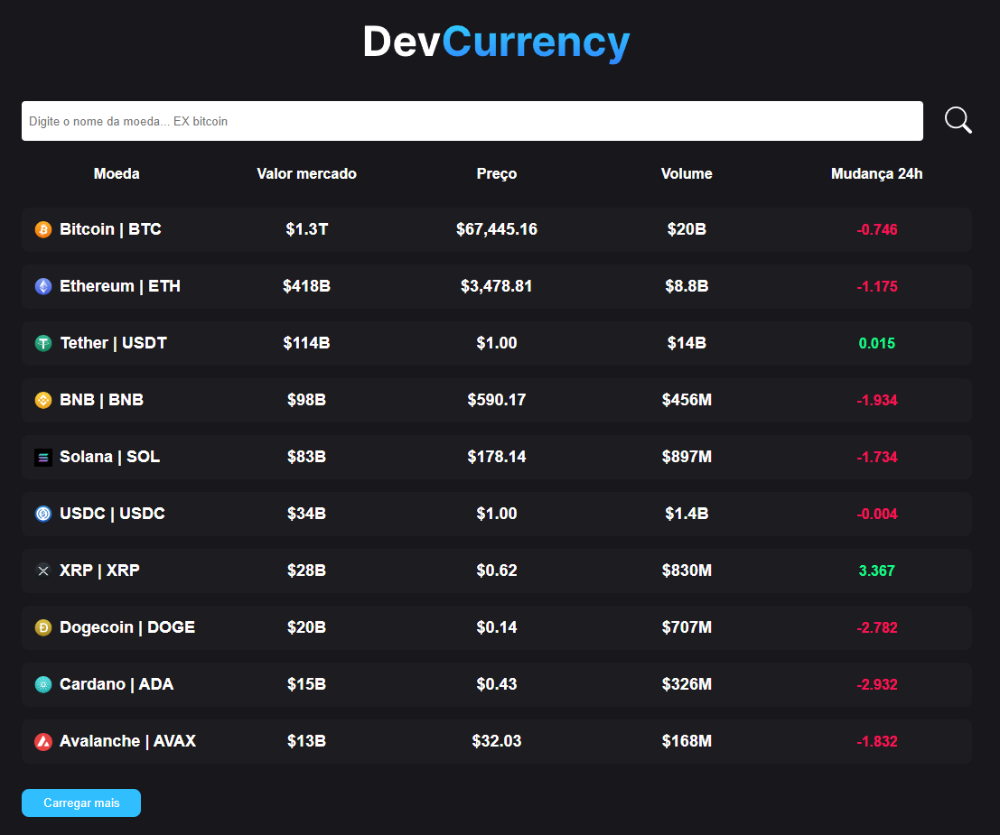

# CrypGio 🌐💻

**CrypGio** é um projeto inovador desenvolvido para aprimorar habilidades no uso de **APIs**, explorando o mundo das criptomoedas de maneira dinâmica e interativa. Criado com **React**, o projeto utiliza recursos como **React Router DOM**, **useParams** e **Styled Components** para fornecer uma experiência de navegação elegante e eficiente.

## 🌟 Funcionalidades

- **Integração com APIs**: Acesso a dados em tempo real sobre as principais criptomoedas diretamente de APIs atualizadas.
- **Navegação Dinâmica**: Implementação de rotas com **React Router DOM** para uma experiência de usuário fluida.
- **Componentização Elegante**: Utilização de **Styled Components** para um design modular e escalável.
- **Exploração Personalizada**: Uso de parâmetros de rota com **useParams** para navegação personalizada através de dados específicos.

## 🚀 Tecnologias Utilizadas

- **React**: Biblioteca JavaScript para construção de interfaces modernas.
- **React Router DOM**: Gerenciamento de rotas para navegação eficiente.
- **Styled Components**: Solução avançada para estilização de componentes React.
- **APIs**: Integração de dados ao vivo das principais criptomoedas.

## 💡 Objetivo

O CrypGio é um projeto criado para explorar a implementação de APIs e melhorar os conceitos de **React** em rotas, destacando as melhores práticas no uso de parâmetros de rota e estilização modular.

## Imagem
